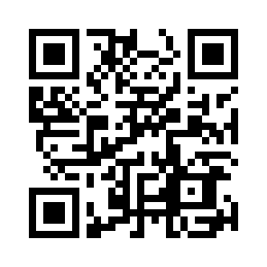

Dit zijn alle activiteiten waar je op Fri3d Camp aan kan deelnemen.

De <a href="tijdsindeling">tijdsindeling</a> kan je ook visueel consulteren. Deze activiteiten gaan door op <a href="locaties">5 locaties</a>.

Het programma is ook beschikbaar als een online kalender (<a href="programma.ics">ics, </a> <a href="webcal://fri3d.be/programma/programma.ics">webcal</a>). Voeg deze toe als een abonnement en je hebt altijd de laatste versie van het programma in je eigen agenda.

Op Android (phones/tablets) heb je de handige <a href="https://play.google.com/store/apps/details?id=net.gaast.giggity&hl=en">Giggity</a> app, speciaal ontworpen om niets te missen op een conferentie. Gebruik in Giggity de QR code, of de volgende URL: <tt>http://fri3d.be/programma/programma.ics</tt> rechtstreeks.


  
  <article class="contentitem activity" id="{{ activity.title | slugify }}">
    <header>
      <h3>{{ activity.title }}</h3>
      
door:  {{speaker}} 

    </header>
    
{{ activity.description }}

    <footer>
      
Op {{ activity.timing.day }} {{ activity.timing.date }} van {{ activity.timing.start }} tot {{ activity.timing.end }} - locatie: <a href="locaties#{{ activity.track | remove: "(" | remove: ")" | slugify }}">{{ activity.track }}</a>

    </footer>
  </article>
  


