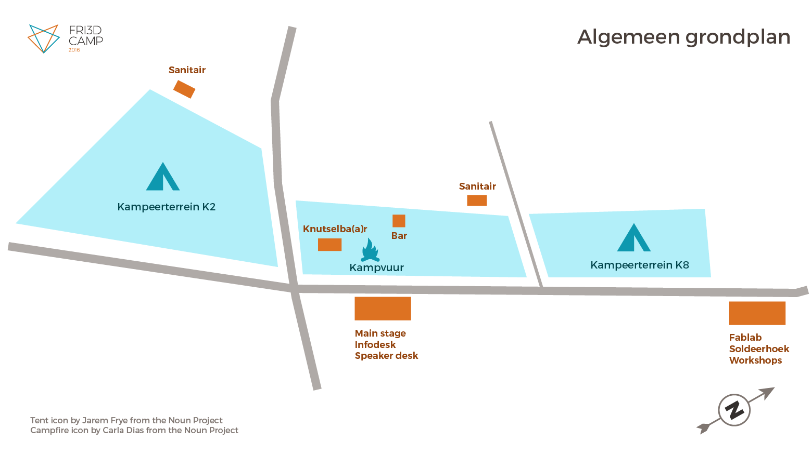

Het Fri3d Camp <a href=".">programma</a> wordt ingedeeld in 5 tracks en bijhorende locaties.

# Main Stage

In Loods 318 bevinden zich naast het Main Stage, waar de presentaties doorgaan, ook de Info Desk en de Speaker Desk. 's Avonds verzamelen we ook aan deze loods om samen het avondeten te nuttigen. Op zaterdagavond, voor de BBQ, worden hier ook de lightening talks georganiseerd en wordt de Rube Goldberg Machine in actie gezet.

Het main stage is voorzien van veel stoelen, een groot podium met geluidsinstallatie en groooot schem.

# Knutselba(a)r

Op het centrale veld (K8-1) bevinden zich de Knutselba(a)r en de bar. De Knutselba(a)r is een tent die volledig gewijd is aan de Fri3d kinderen. Alle workshops die speciaal voor hen worden georganiseerd, vinden hier plaats. Wanneer er geen workshops bezig zijn, is alles voorzien om zelf nog aan de slag te gaan met tal van knutselmateriaal. Dit is dé plek voor de Fri3d kinderen.

In de Knutselba(a)r zijn voldoende tafels en stoelen voorzien om aan de slag te gaan. Een groot scherm laat toe om inspiratie te tonen.

# FabLab

Het FabLab is dé plek waar alle hackers en makers hun plek kunnen innemen en aan hun projecten werken, samen nieuwe plannen smeden en ad-hoc workshops organiseren.

Naast deze vrije ruimte zijn ook twee tracks hier gehuisvest:

## Workshops

Alle officiële workshops gaan door in de workshop-ruimte. Hier zijn veel tafels, stoelen en een groot scherm voorzien.

## Soldeerhoek

De soldeerhoek biedt alle faciliteiten om aan de slag te gaan. Veel soldeerbouten en enkele emmers water zorgen voor een veilige omgeving voor alle leeftijden om te leren solderen of om samen complexe projecten vorm te geven.

# Op het terrein

En dan is er de fantastische omgeving van de Hoge Rielen. Midden van de bossen slaan we onze tenten op. Maar op het terrein gaan ook verschillende activiteiten door.

Laat je zeker ook verrassen door de prachtige verlichting en merk op dat jij er zelf effect op hebt.

