Fri3d Camp wordt in eerste plaats gemaakt door zijn deelnemers. Maar ondanks
hun enorme inzet en grootse bijdrage, heeft Fri3d Camp ook nog wat extra
ondersteuning nodig. De volgende mensen en bedrijven dragen Fri3d Camp dat
warme hart toe en zetten hun schouders onder onze zaak.

Zij verdienen meer dan een schouderklopje hiervoor en we stellen ze dan ook
graag aan jullie voor. Als je ze tegenkomt om kamp, bedank ze dan hartelijk.
Want ze maken Fri3d Camp weer dat iets specialer voor jou!

# Ondersteunende bedrijven

<h3 class="anchor">Rombit</h3>

<h1 align="center" markdown="1">[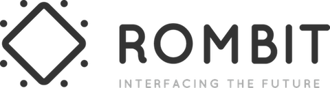](http://rombit.be)</h1>

**Rombit mag zich terecht Platinum Sponsor noemen van Fri3d Camp 2016. Met een financiële ondersteuning ter waarde van de aankoopkosten voor de componenten van de [Fri3d Camp Badge](https://github.com/Fri3dCamp/badge), dragen zij een zeer groot steentje bij voor elke deelnemer!**

Rombit ontwikkelt smart industry en smart city producten met behulp van Internet of Things en Machine Learning technologie. Het bedrijf is bekend van de slimme verkeersborden A Sign en de mobiele werfscanners BadgeControl. Het voornaamste product Romcore koppelt met bestaande IT-infrastructuren, combineert datasets, laat machines toe zelflerend te zijn en bundelt alles in overzichtelijke en mobiele interfaces. Systemen worden ook slimmer gemaakt door toevoeging van IoT-sensortechnologie. 

Rombit kwam recent nog in het nieuws door haar succesvolle kapitaalronde van 10 miljoen euro. Het bedrijf breidt fors uit en is volop op zoek naar ingenieurs, project managers en developers.

[http://rombit.be](http://rombit.be)

<h3 class="anchor">Playpass</h3>

<h1 align="center" markdown="1">[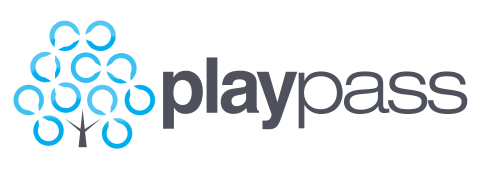](http://playpass.be)</h1>

**Dankzij de financiële steun van Playpass kunnen we dit kamp voor de full option gaan, zonder ons budget of de ticketprijzen in gevaar te brengen. Passend bij hun festivalachtergrond, zorgen ze ook voor unieke Fri3d Camp polsbandjes!**

[http://playpass.be](http://playpass.be)

<h3 class="anchor">Inventive designers</h3>

[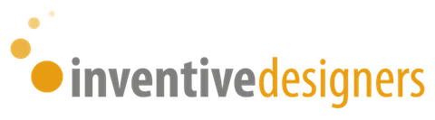](https://www.inventivedesigners.com)

**Voor de tweede editie op rij, steunt Inventive Designers Fri3d Camp financieel. Dankzij hun bijdrage kunnen we verschillende zaken realiseren en houden we de ticket prijzen opnieuw onder controle!**

[https://www.inventivedesigners.com](https://www.inventivedesigners.com)

<h3 class="anchor">Novid</h3>

[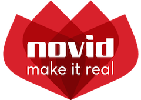](http://www.novid.be)

**Net zoals tijdens de eerste editie, verzorgt Novid opnieuw alle AV ondersteuning; projectoren, schermen, boxen,... Novid zorgt ervoor dat je alle activiteiten kan ervaren in de beste auditieve en visuele omstandigheden.**

[http://www.novid.be](http://www.novid.be)

<h3 class="anchor">Wireless België</h3>

[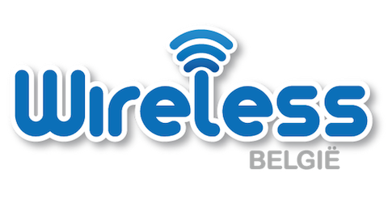](http://wirelessbelgie.be)

**Toegang tot internet, het lijkt tegenwoordig bijna zo vanzelfsprekend. Maar om heel Fri3d Camp in de bossen van de Hoge Rielen van een internetverbinding te voorzien, met een  dekkend draadloos netwerk voor alle deelnemers, dat is minder vanzelfsprekend. Wireless België zorgt er ook deze editie weer voor dat elke like en elke foto zijn weg naar de sociale media vindt.**

[http://wirelessbelgie.be](http://wirelessbelgie.be)

<h3 class="anchor">De Werkkamer</h3>

[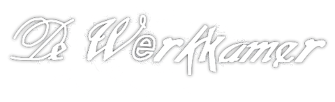](http://www.dewerkkamer.be)

**Als je weldra aan de bar plaats neemt aan &eacute;&eacute;n van onze unieke tafeltjes en je het vakmanschap ervan bewondert, richt dan gerust een dikke proficiat en dank u aan De Werkkamer.**

[http://www.dewerkkamer.be](http://www.dewerkkamer.be)

# Ondersteunende deelnemers

Sommige deelnemers willen naast hun activiteit Fri3d Camp nog verder ondersteunen. Met een business ticket tastten ze iets dieper in hun buidel en helpen zo om Fri3d Camp weer wat leuker te maken. Bedankt!

  [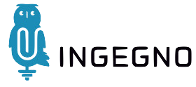](http://ingegno.be)&nbsp;
  [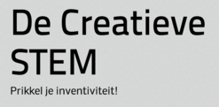](http://decreatievestem.be)&nbsp;
  [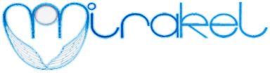](http://mirakel.be) 
  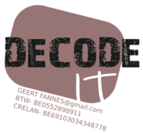&nbsp;
  [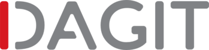](http://dagit.be)

# Ondersteunende organisaties

De inspiratie van dit kamp komt uit vele Belgische en Europese non-profit organisaties, kampen, hackerspaces en fablabs die onze gemeenschap ondersteunen en vertegenwoordigen. Fri3d Camp is zeer blij dat deze organisaties als partner voor Fri3d Camp willen optreden.

  [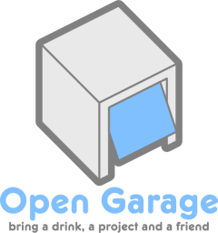](http://opengarage.org)
    
  [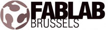](http://fablab-brussels.be)

# Wil jij ook Fri3d Camp steunen?

Sta je met je bedrijf achter het gedachtengoed dat Fri3d Camp verspreid? We kunnen je hulp via sponsoring goed gebruiken, contacteer ons via <a href="mailto:info@fri3d.be">info@fri3d.be</a>.